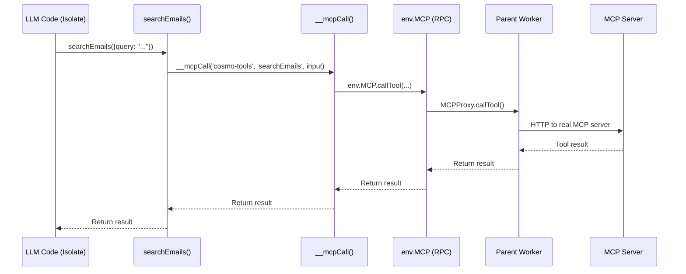

## Overview

Code-Exec provides **dual-path code execution** optimized for different use cases:

<CardGroup cols={2}>
  <Card title="Isolates (Fast)" icon="bolt">
    **~10ms startup**
    
    JavaScript execution in V8 isolates with virtual filesystem
  </Card>
  <Card title="Containers (Capable)" icon="box">
    **~200ms startup**
    
    TypeScript/Python/Shell with real Linux filesystem
  </Card>
</CardGroup>

## Runtime Routing

```typescript
runtime === 'javascript' → Isolate (V8, virtual fs)
runtime === 'typescript' → Container (bun, real fs)
runtime === 'python'     → Container (python3, real fs)
runtime === 'shell'      → Container (bash, real fs)
```

## Isolate Path (JavaScript)

### Characteristics

- **Startup**: ~10ms
- **Total**: ~100-150ms
- **Filesystem**: Virtual (in-memory via custom `node:fs` module)
- **Languages**: JavaScript only (ES6+)
- **MCP Calls**: ✅ Via RPC loopback

### Virtual Filesystem

The isolate includes a **virtual `node:fs` module** that LLMs can import naturally:

```javascript
import fs from 'node:fs';

// Discover servers
const servers = fs.readdirSync('/mnt/servers');
// → ['cosmo-tools']

// Discover tools
const tools = fs.readdirSync('/mnt/servers/cosmo-tools');
// → ['searchEmails.js', 'getEmail.js', ...42 tools]

// Read tool code
const code = fs.readFileSync('/mnt/servers/cosmo-tools/searchEmails.js', 'utf-8');

// Import and use
import { searchEmails } from '/mnt/servers/cosmo-tools/searchEmails.js';
const results = await searchEmails({ query: "is:unread" });
```

### How It Works

<Steps>
  <Step title="Tool Generation">
    MCP schemas → JavaScript files with JSDoc
  </Step>
  
  <Step title="Module Loading">
    All tool files loaded into Worker Loader's modules object
  </Step>
  
  <Step title="Virtual FS Module">
    Custom `node:fs` module contains all file data as JSON
  </Step>
  
  <Step title="Import Resolution">
    V8 resolves imports from modules object
  </Step>
  
  <Step title="MCP Calls">
    Tools call `__mcpCall()` → RPC to parent → Real MCP server
  </Step>
</Steps>

### Code Wrapping

User code is wrapped to provide the Worker Loader's required `export default { fetch() }` structure:

```javascript
// User writes:
import fs from 'node:fs';
const servers = fs.readdirSync('/mnt/servers');
console.log('Found:', servers.length);

// We wrap it as:
import fs from 'node:fs';  // ← Extracted to top level

export default {
  async fetch(request, env, ctx) {
    globalThis.__mcpCall = async (...) => await env.MCP.callTool(...);
    
    const logs = [];
    console.log = (...args) => logs.push(args.join(' '));
    
    try {
      // User code here
      const servers = fs.readdirSync('/mnt/servers');
      console.log('Found:', servers.length);
      
      return Response.json({ logs, error: null });
    } catch (error) {
      return Response.json({ logs, error: error.message });
    }
  }
}
```

## Container Path (TypeScript/Python/Shell)

### Characteristics

- **Startup**: ~200ms
- **Total**: ~300-2000ms (depends on operations)
- **Filesystem**: Real Linux filesystem
- **Languages**: TypeScript (bun), Python 3, Bash
- **MCP Calls**: ✅ **WORKING via HTTP bridge!**

### Tool Generation

For containers, we generate **real TypeScript files** with full type annotations:

```typescript
// Generated file: searchEmails.ts
import { __mcpCall } from '../_client.js';

export interface SearchEmailsInput {
  /** Gmail search query */
  query: string;
  /** Max results (optional) */
  maxResults?: number;
}

/**
 * Search user's Gmail inbox
 */
export async function searchEmails(input: SearchEmailsInput) {
  return __mcpCall('cosmo-tools', 'searchEmails', input);
}
```

### Language Examples

<CodeGroup>

```typescript TypeScript
import fs from 'fs';
import { searchEmails } from '/mnt/servers/cosmo-tools/searchEmails';

interface Result {
  emails: any[];
}

const results = await searchEmails({ 
  query: 'is:unread', 
  maxResults: 10 
});
console.log('Found emails');
```

```python Python
import os

# Discover tools
tools = os.listdir('/mnt/servers/cosmo-tools')
print(f'Found {len(tools)} tools')

# Read tool code
with open('/mnt/servers/cosmo-tools/searchEmails.ts', 'r') as f:
    code = f.read()
    print(f'Code length: {len(code)}')
```

```bash Shell
# List all tools
ls -l /mnt/servers/cosmo-tools

# Count tools
ls /mnt/servers/cosmo-tools/*.ts | wc -l
```

</CodeGroup>

## MCP Call Flow (Isolates)



**Key Technology**: `ctx.exports` (RPC loopback bindings)

## Configuration

### wrangler.jsonc

```jsonc
{
  "compatibility_date": "2025-09-01",  // Enables ephemeral filesystem
  "compatibility_flags": [
    "nodejs_compat",      // Enables Node.js APIs
    "enable_ctx_exports"  // Enables RPC loopback
  ],
  "worker_loaders": [
    { "binding": "LOADER" }  // Dynamic isolate loader
  ]
}
```

### Dynamic Isolate Config

```typescript
env.LOADER.get(workerId, () => {
  return {
    compatibilityDate: '2025-09-01',
    compatibilityFlags: ['nodejs_compat'],
    
    modules: {
      'main.js': { js: wrappedUserCode },
      'node:fs': { js: virtualFsModule },
      'mnt/servers/cosmo-tools/searchEmails.js': { js: toolModule },
      // ...all other tools
    },
    
    env: {
      MCP: ctx.exports.MCPProxy({ props: { userId } })
    },
    
    globalOutbound: null  // No internet access
  };
});
```

## Benefits

<CardGroup cols={2}>
  <Card title="Speed" icon="gauge-high">
    Isolates start in ~10ms
    
    100x faster than containers for JavaScript
  </Card>
  
  <Card title="Discovery" icon="magnifying-glass">
    LLMs explore filesystem
    
    No tool enumeration needed
  </Card>
  
  <Card title="Security" icon="shield">
    Sandboxed execution
    
    No internet, RPC-only communication
  </Card>
  
  <Card title="Cost" icon="dollar-sign">
    Isolates use less memory
    
    Faster = cheaper
  </Card>
</CardGroup>

## Next Steps

<Card title="Learn Core Concepts" href="/concepts/runtime-split">
  Deep dive into runtime selection and virtual filesystem
</Card>

