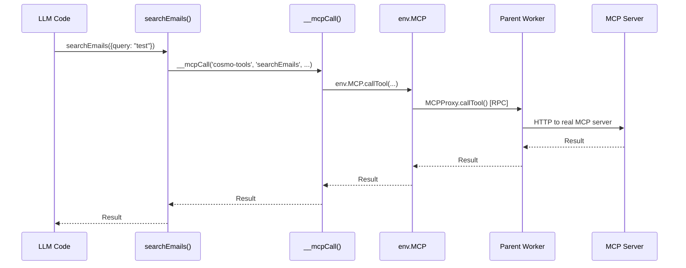

## Overview

Code-Exec enables LLMs to call **Model Context Protocol (MCP) tools** from their generated code using natural imports.

<Info>
**MCP Status**:
- **Isolates**: ✅ Working via RPC loopback (`ctx.exports`)
- **Containers**: ✅ Working via HTTP bridge to Durable Object!
</Info>

## How It Works (Isolates)

### 1. Tool Generation

MCP server schemas are converted to JavaScript modules:

```javascript
// Generated: /mnt/servers/cosmo-tools/searchEmails.js
import { __mcpCall } from '../_client.js';

/**
 * @param {Object} input
 * @param {string} input.query Gmail search query
 */
export async function searchEmails(input) {
  return __mcpCall('cosmo-tools', 'searchEmails', input);
}
```

### 2. MCP Client Runtime

A `_client.js` file provides the `__mcpCall` function:

```javascript
// /mnt/servers/_client.js
export async function __mcpCall(serverName, toolName, input) {
  return await globalThis.__mcpCall(serverName, toolName, input);
}
```

### 3. Global Injection

The wrapper code injects the actual MCP proxy:

```javascript
globalThis.__mcpCall = async (serverName, toolName, input) => {
  return await env.MCP.callTool(serverName, toolName, input);
};
```

### 4. RPC Loopback

The `env.MCP` binding uses `ctx.exports` for RPC back to parent:

```typescript
// Parent Worker
export class MCPProxy extends WorkerEntrypoint {
  async callTool(serverName: string, toolName: string, input: any) {
    return await mcpRegistry.callTool(serverName, toolName, input, {
      userId: this.ctx.props.userId,
      isOwner: this.ctx.props.isOwner
    });
  }
}

// Isolate gets it
env.MCP = ctx.exports.MCPProxy({ 
  props: { userId, isOwner: true } 
});
```

## Call Flow



## Usage Example

```javascript
import fs from 'node:fs';

// Discover available email tools
const tools = fs.readdirSync('/mnt/servers/cosmo-tools')
  .filter(f => f.includes('email') || f.includes('Email'));

console.log('Email tools:', tools);
// → ['searchEmails.js', 'getEmail.js', 'sendEmail.js', ...]

// Import and use
import { searchEmails } from '/mnt/servers/cosmo-tools/searchEmails.js';
import { sendSMS } from '/mnt/servers/cosmo-tools/sendSMS.js';

// Call multiple MCP tools in one execution
const emails = await searchEmails({ 
  query: 'is:unread', 
  maxResults: 1 
});

if (emails.length > 0) {
  await sendSMS({ 
    to: '+1234567890', 
    message: `You have ${emails.length} unread emails` 
  });
}

console.log('Notification sent!');
```

## MCP Server Configuration

MCP servers are configured via environment variable:

```json
MCP_SERVERS=[
  {
    "name": "cosmo-tools",
    "url": "https://cosmo-mcp-server.example.com",
    "credentials": {
      "type": "bearer",
      "token": "secret-token"
    }
  }
]
```

**Security**: API tokens are **never exposed to the isolate**. All calls are proxied through the parent Worker.

## Tool Schema Example

**MCP Server Response:**
```json
{
  "tools": [
    {
      "name": "searchEmails",
      "description": "Search Gmail inbox",
      "inputSchema": {
        "type": "object",
        "properties": {
          "query": {
            "type": "string",
            "description": "Gmail search query"
          },
          "maxResults": {
            "type": "number",
            "description": "Max results"
          }
        },
        "required": ["query"]
      }
    }
  ]
}
```

**Generated JavaScript (Isolate):**
```javascript
/**
 * Search Gmail inbox
 */
/**
 * @param {Object} input
 * @param {string} input.query Gmail search query
 * @param {number}? input.maxResults Max results
 */
export async function searchEmails(input) {
  return __mcpCall('cosmo-tools', 'searchEmails', input);
}
```

**Generated TypeScript (Container):**
```typescript
export interface SearchEmailsInput {
  /** Gmail search query */
  query: string;
  /** Max results */
  maxResults?: number;
}

/**
 * Search Gmail inbox
 */
export async function searchEmails(input: SearchEmailsInput) {
  return __mcpCall('cosmo-tools', 'searchEmails', input);
}
```

## Error Handling

MCP calls can fail - the LLM receives full error details:

```javascript
try {
  const result = await searchEmails({ query: 'invalid' });
} catch (error) {
  console.log('MCP call failed:', error.message);
  // Error details returned to LLM
}
```

## Containers (HTTP Bridge)

<Check>
**MCP calls from containers FULLY WORKING!**

Containers use HTTP bridge to Worker's `/__mcp_rpc` endpoint, which uses `ctx.exports` for RPC loopback.
</Check>

### Architecture

```
Container Code → host.docker.internal:8787/__mcp_rpc 
  → Worker uses ctx.exports.MCPProxy() 
  → Real MCP Server
```

**Worker Endpoint:**
```typescript
// Main Worker endpoint
if (path === '/__mcp_rpc' && request.method === 'POST') {
  const { userId, serverName, toolName, input } = await request.json();
  
  // Use ctx.exports to call MCPProxy entrypoint (RPC loopback)
  const result = await ctx.exports.MCPProxy({ 
    props: { userId, isOwner: true } 
  }).callTool(serverName, toolName, input);
  
  return Response.json({ success: true, result });
}
```

**Container Wrapper:**
```typescript
// Injected into every container execution
globalThis.__mcpCall = async (serverName, toolName, input) => {
  const response = await fetch('http://host.docker.internal:8787/__mcp_rpc', {
    method: 'POST',
    headers: { 'Content-Type': 'application/json' },
    body: JSON.stringify({ userId, serverName, toolName, input })
  });
  
  const data = await response.json();
  if (data.error) throw new Error(data.error);
  return data.result;
};
```

**Generated Tool (works in both isolates and containers!):**
```typescript
export async function searchEmails(input) {
  return __mcpCall('cosmo-tools', 'searchEmails', input);
}
```

### Why This Works

1. **`host.docker.internal`** - Containers can reach the host Worker from inside Docker
2. **`ctx.exports`** - Workers can call their own exported entrypoints via RPC loopback
3. **No SDK patching** - Clean HTTP bridge, production ready!

**LLM just imports and calls - completely transparent across all runtimes!**

## Next Steps

<Card title="Error Handling" href="/guides/error-handling">
  Learn how errors are reported to LLMs
</Card>

