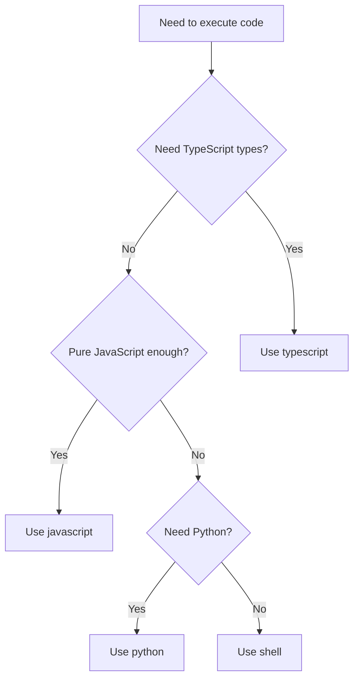

## The Four Runtimes

Code-Exec supports **four execution runtimes**, automatically routing to the appropriate sandbox:

| Runtime | Sandbox | Startup | Filesystem | Best For |
|---------|---------|---------|------------|----------|
| `javascript` | Isolate | ~10ms | Virtual | Fast MCP orchestration |
| `typescript` | Container | ~200ms | Real | Types, file operations |
| `python` | Container | ~200ms | Real | Data analysis |
| `shell` | Container | ~200ms | Real | Linux commands |

## When to Use Each

### JavaScript (Isolate)

<Check>**Use when:**</Check>
- Quick MCP tool calls
- Speed is critical (~10ms vs ~200ms)
- Pure JavaScript is sufficient
- Don't need TypeScript types

<Warning>**Cannot:**</Warning>
- Use TypeScript syntax (`interface`, `type`)
- Save skills or files (virtual fs is read-only)
- Run Python or shell
- Use npm packages

**Example:**
```javascript
import fs from 'node:fs';
import { searchEmails } from '/mnt/servers/cosmo-tools/searchEmails.js';

const emails = await searchEmails({ query: 'is:unread', maxResults: 5 });
console.log('Found ' + emails.length + ' unread emails');
```

### TypeScript (Container)

<Check>**Use when:**</Check>
- Need TypeScript interfaces/types
- Need to save skills
- Need file operations
- Default for most tasks

<Warning>**Slower:**</Warning>
- ~200ms startup vs ~10ms for isolates

**Example:**
```typescript
import fs from 'fs';
import { searchEmails } from '/mnt/servers/cosmo-tools/searchEmails';

interface Email {
  subject: string;
  from: string;
}

const results = await searchEmails({ query: 'is:unread', maxResults: 5 });
console.log('Found emails');
```

### Python (Container)

<Check>**Use when:**</Check>
- Data analysis needed
- Using pandas/numpy
- Python-specific libraries
- Scientific computing

**Example:**
```python
import os
import pandas as pd

# Discover tools
tools = os.listdir('/mnt/servers/cosmo-tools')
print(f'Found {len(tools)} tools')

# Data analysis
df = pd.DataFrame({'a': [1, 2, 3]})
print(df.describe())
```

### Shell (Container)

<Check>**Use when:**</Check>
- Need Linux commands
- File operations via CLI
- Piping and scripting

**Example:**
```bash
# List all tools
ls -la /mnt/servers/cosmo-tools

# Count lines in all tool files
wc -l /mnt/servers/cosmo-tools/*.ts
```

## Performance Comparison

Based on test results:

```
Isolate (JavaScript):   ~10ms startup  + ~100ms execution  = ~110ms total
Container (TypeScript): ~200ms startup  + ~100ms execution  = ~300ms total
Container (Python):     ~200ms startup  + ~100ms execution  = ~300ms total
```

**Isolates are 3x faster** but JavaScript-only.

## Choosing the Right Runtime

### Decision Tree



### Quick Reference

**Default choice:** `typescript` (container) - Most flexible

**Speed optimization:** `javascript` (isolate) - When types not needed

**Data analysis:** `python` (container) - For pandas/numpy

**CLI operations:** `shell` (container) - For bash commands

## Example Workflows

### Fast MCP Orchestration (JavaScript)

```javascript
import fs from 'node:fs';
import { searchEmails } from '/mnt/servers/cosmo-tools/searchEmails.js';
import { sendSMS } from '/mnt/servers/cosmo-tools/sendSMS.js';

// Discover tools
const tools = fs.readdirSync('/mnt/servers/cosmo-tools');
console.log('Available:', tools.length);

// Chain multiple MCP calls
const emails = await searchEmails({ query: 'is:unread', maxResults: 1 });
if (emails.length > 0) {
  await sendSMS({ 
    to: '+1234567890', 
    message: 'You have ' + emails.length + ' unread emails' 
  });
}
```

### TypeScript with Type Safety

```typescript
import fs from 'fs';
import { searchEmails } from '/mnt/servers/cosmo-tools/searchEmails';

interface EmailSummary {
  count: number;
  subjects: string[];
}

async function summarizeEmails(): Promise<EmailSummary> {
  const emails = await searchEmails({ query: 'is:unread' });
  return {
    count: emails.length,
    subjects: emails.map(e => e.subject)
  };
}

const summary = await summarizeEmails();
console.log(`Found ${summary.count} emails`);
```

### Python Data Analysis

```python
import pandas as pd
import numpy as np

# Create sample data
data = {
    'name': ['Alice', 'Bob', 'Charlie'],
    'score': [85, 92, 78]
}

df = pd.DataFrame(data)

# Analysis
print(f"Mean score: {df['score'].mean()}")
print(f"Max score: {df['score'].max()}")
print(df.describe())
```

## Tool Generation Strategy

Code-Exec **adapts output based on sandbox type**:

### JavaScript (Isolates)

```javascript
// searchEmails.js
import { __mcpCall } from '../_client.js';

/**
 * Search Gmail inbox
 */
/**
 * @param {Object} input
 * @param {string} input.query Search query
 * @param {number}? input.maxResults Max results
 */
export async function searchEmails(input) {
  return __mcpCall('cosmo-tools', 'searchEmails', input);
}
```

### TypeScript (Containers)

```typescript
// searchEmails.ts
import { __mcpCall } from '../_client.js';

export interface SearchEmailsInput {
  /** Search query */
  query: string;
  /** Max results */
  maxResults?: number;
}

/**
 * Search Gmail inbox
 */
export async function searchEmails(input: SearchEmailsInput) {
  return __mcpCall('cosmo-tools', 'searchEmails', input);
}
```

<Info>
**Smart Detection**: Generator checks `sandbox.type` and creates appropriate files automatically!
</Info>

## Next Steps

<CardGroup>
  <Card title="Virtual Filesystem" href="/concepts/virtual-filesystem">
    Learn how the virtual node:fs module works
  </Card>
  <Card title="Tool Discovery" href="/concepts/tool-discovery">
    Discover MCP tools dynamically
  </Card>
</CardGroup>

