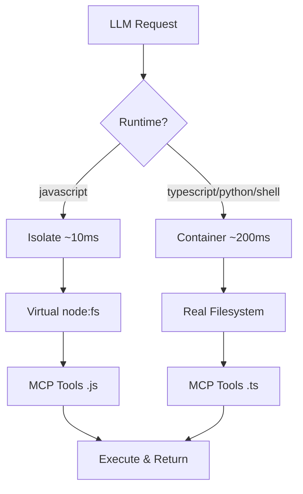

# Welcome to Code-Exec

**Fast, capable, and intelligent code execution for LLM agents.**

Code-Exec enables LLMs to execute code in **four runtimes with FULL MCP parity**:
- **JavaScript** (~10ms) - V8 isolates, MCP via RPC loopback ✅
- **TypeScript** (~200ms) - Containers, MCP via HTTP bridge ✅
- **Python** (~200ms) - Containers, MCP via HTTP bridge ✅
- **Shell** (~200ms) - Containers, filesystem discovery ✅

<CardGroup cols={2}>
  <Card
    title="Quick Start"
    icon="rocket"
    href="/quickstart"
  >
    Get up and running in 5 minutes
  </Card>
  <Card
    title="Architecture"
    icon="sitemap"
    href="/architecture"
  >
    Understand the dual-path execution model
  </Card>
  <Card
    title="API Reference"
    icon="code"
    href="/api/execute"
  >
    Execute code via HTTP API
  </Card>
  <Card
    title="Testing"
    icon="flask"
    href="/testing/overview"
  >
    30 comprehensive tests validating all features
  </Card>
</CardGroup>

## Key Features

<AccordionGroup>
  <Accordion title="Dynamic Tool Discovery">
    LLMs can explore `/mnt/servers/` to discover available MCP tools at runtime. No need to enumerate tools in prompts!
    
    ```javascript
    import fs from 'node:fs';
    const tools = fs.readdirSync('/mnt/servers/cosmo-tools');
    // → Discovers 42 tools dynamically!
    ```
  </Accordion>

  <Accordion title="Virtual Filesystem (Isolates)">
    Custom `node:fs` module provides in-memory filesystem for V8 isolates. LLMs write natural code!
    
    ```javascript
    import fs from 'node:fs';
    const servers = fs.readdirSync('/mnt/servers');
    const code = fs.readFileSync('/mnt/servers/cosmo-tools/searchEmails.js');
    ```
  </Accordion>

  <Accordion title="Multi-Language Support">
    Execute JavaScript, TypeScript, Python, or Shell:
    
    - **JavaScript**: Isolates (~10ms)
    - **TypeScript**: Containers with bun (~200ms)
    - **Python**: Containers with python3 (~200ms)
    - **Shell**: Containers with bash (~200ms)
  </Accordion>

  <Accordion title="MCP Integration">
    Call Model Context Protocol tools via RPC loopback:
    
    ```javascript
    import { searchEmails } from '/mnt/servers/cosmo-tools/searchEmails.js';
    const results = await searchEmails({ query: "is:unread" });
    ```
  </Accordion>
</AccordionGroup>

## Performance

| Runtime | Sandbox | Startup | Total | Use Case |
|---------|---------|---------|-------|----------|
| JavaScript | Isolate | ~10ms | ~120ms | Fast MCP orchestration |
| TypeScript | Container | ~200ms | ~2000ms | Types, file operations |
| Python | Container | ~200ms | ~2000ms | Data analysis |

## Architecture Overview



## Ready to Start?

<Card
  title="Quickstart Guide"
  icon="play"
  href="/quickstart"
>
  Execute your first code in 2 minutes
</Card>
